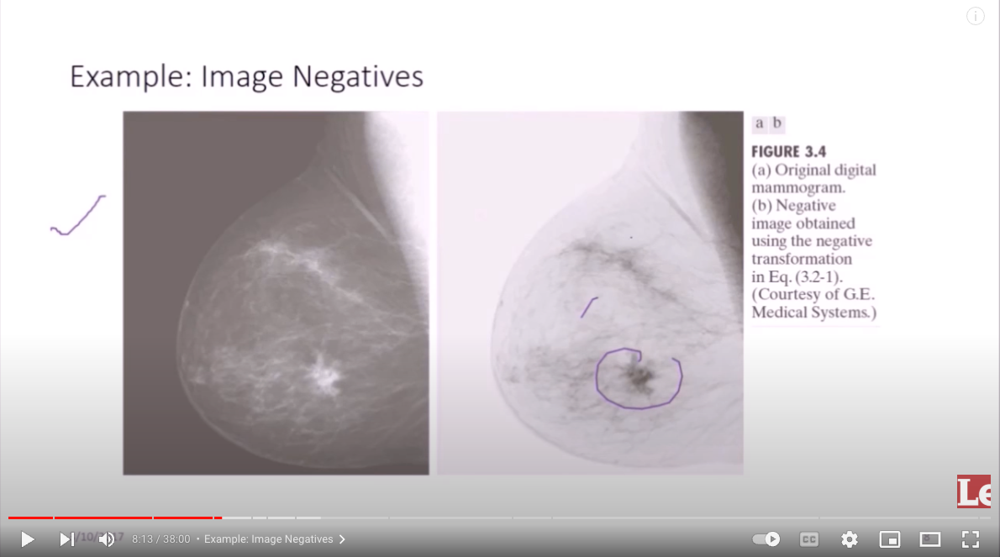

# Topics

## Digital Image Fundamental
## Image sensing and acquisition

```text
อ่านค่าจากเครื่องมือ sensor ได้เป็น analog image
```

## Image sampling and Quantization

```text
แปลงค่าจาก analog -> digital

sampling = แปลง coordinate
quantization = แปลง amplitude
```


## Intensity Transformation

```text
- Image Negative (black-white) -> (white-black)
S = L-1-r
```



```text
- Log Transformations
- Power Law Transformations
```

## Filtering in frequency domain


## Morphological Image Processing
## Convolutional Neural Network
## Application
